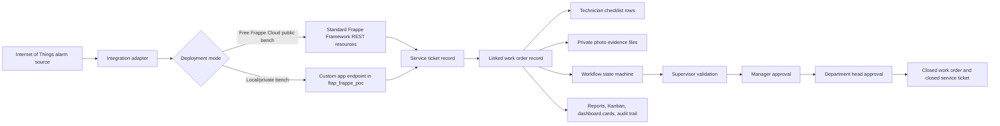
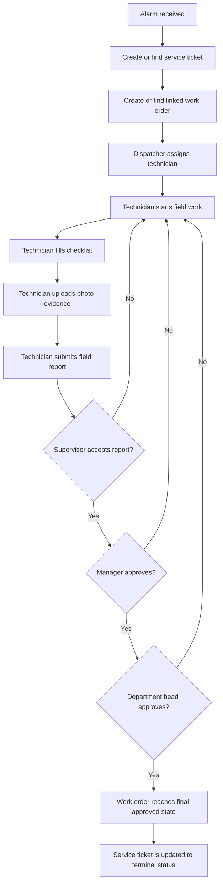
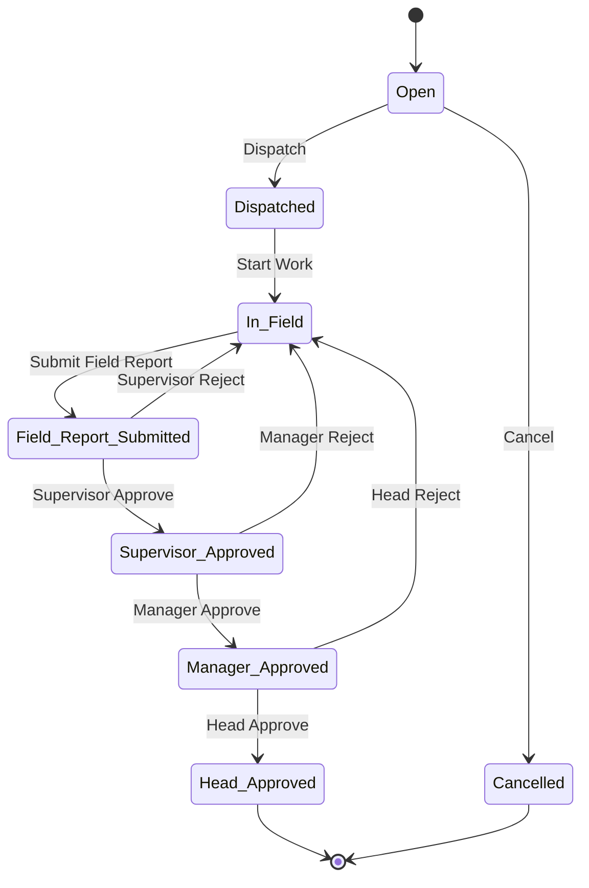
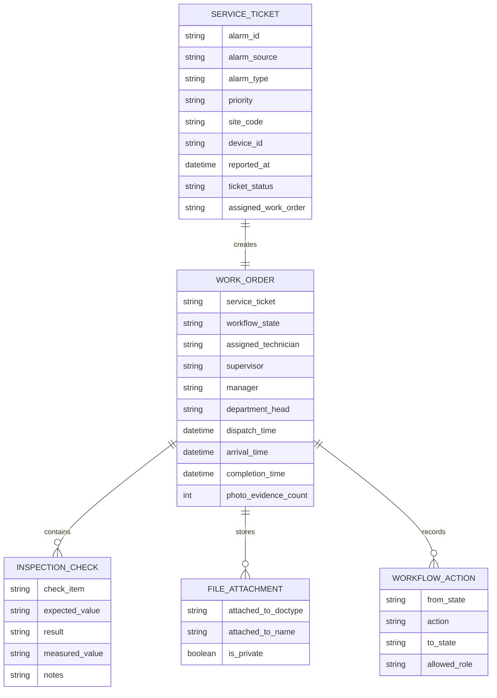
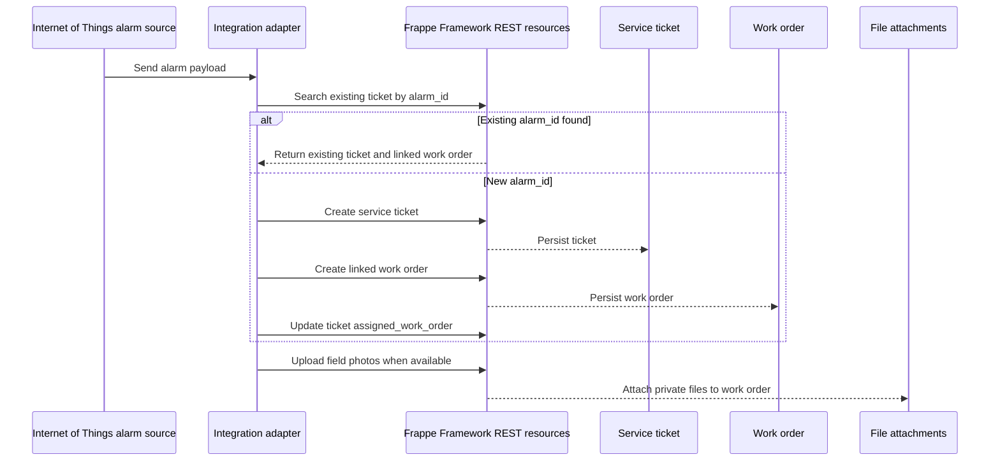
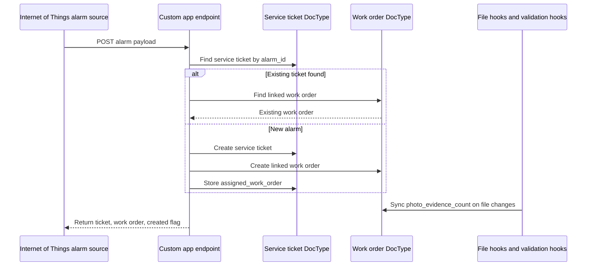
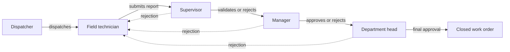
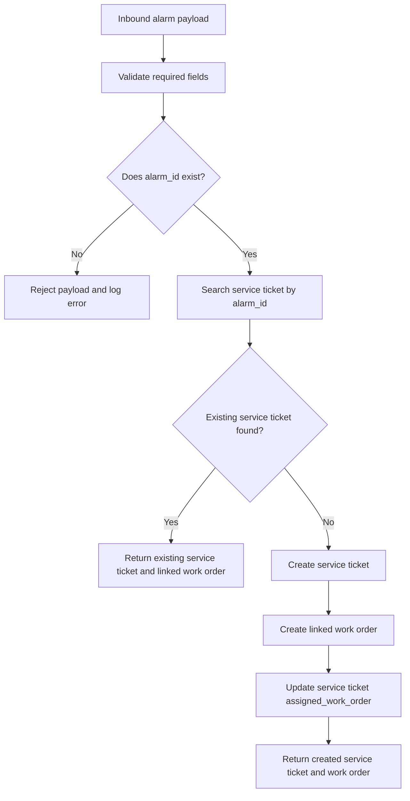
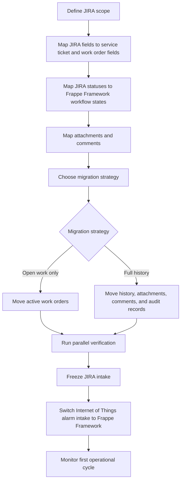

# Frontier Tower Associates Philippines Inc. (FTAP) Frappe Framework Proof of Concept (POC) Runbook

This runbook is the single source of truth for the Frontier Tower Associates Philippines Inc. (FTAP) Frappe Framework proof of concept (POC) for ticketing, work orders, field technician reporting, photo evidence, and approval workflow management.

Current Frappe Framework proof of concept (POC) site:

```text
https://erpnext-ftap-poc.frappe.cloud
```

Current Frappe Framework workspace:

```text
https://erpnext-ftap-poc.frappe.cloud/app/ftap-operations
```

Current Git repository:

```text
https://github.com/rgalor-ca/frappe-ftap-poc
```

Application package:

```text
ftap_frappe_poc
```

## Terminology

| Term | Meaning |
| --- | --- |
| Frontier Tower Associates Philippines Inc. (FTAP) | The operating organization for this field operations workflow. |
| Proof of concept (POC) | The working implementation used to prove the replacement path before pilot or production rollout. |
| Frappe Framework | The low-code/full-stack web framework and workflow platform used for this replacement path. |
| Frappe Cloud | The hosted Frappe service where the current free public-bench proof of concept (POC) site exists. |
| JIRA | The current work-order dependency being replaced for this process. |
| IoT | Internet of Things alarm source for tower/site/device incidents. |

Exact configured object names keep their current prefix, for example `FTAP Service Ticket`, `FTAP Work Order`, `FTAP Inspection Check`, `FTAP Dispatcher`, and `FTAP Work Order Approval`. Those names are retained because they are the actual DocType, role, and workflow names in the Frappe Framework application.

## Executive Summary

The Frontier Tower Associates Philippines Inc. (FTAP) Frappe Framework proof of concept (POC) proves that the JIRA-dependent work-order path can be moved into native Frappe Framework records and workflows.

The process being replaced is:

1. An Internet of Things alarm is received from a tower, site, or device.
2. The alarm opens a service ticket.
3. The service ticket creates or links one work order.
4. A dispatcher assigns a field technician.
5. The field technician performs onsite checks.
6. The field technician fills checklist rows, records measurements, writes notes, and uploads photos.
7. A supervisor validates whether the field report is correct.
8. A manager approves after supervisor validation.
9. A department head performs the final approval.
10. The work order closes and the linked service ticket reaches its terminal status.

The current free Frappe Cloud implementation uses Frappe Framework metadata, standard REST resources, roles, workflow, reports, Kanban, dashboard cards, and file attachments. The repository contains the custom application path for local bench or private Frappe Cloud bench deployment.

The main decision is not whether Frappe Framework can model the process. The proof of concept (POC) already models it. The next decision is when to move from free public-bench configuration to a private bench that can run the custom app, custom Python endpoint, hooks, migrations, and deeper integration logic.

## Important Implementation Principle

The free Frappe Cloud public bench is useful for proving the business workflow with native Frappe Framework configuration. It cannot install a custom Git app.

Use the free public-bench path for:

- DocTypes
- roles
- workflows
- reports
- dashboard cards
- Kanban board
- file attachments
- standard Frappe Framework REST resources
- business process review
- role-based user acceptance testing

Use a local bench or private Frappe Cloud bench for:

- installing this repository as a custom Frappe Framework application
- custom Python methods
- custom server-side validation
- custom hooks
- migrations
- integration logs
- idempotent alarm intake endpoint
- production-like release control

## High-Level Architecture



## End-To-End Process Flow



## Workflow State Machine



## Data Model Visual



## Free Frappe Cloud Public-Bench Flow



## Private Bench Custom-App Flow



## Operational Ownership Flow



## Current Implementation State

The current Frontier Tower Associates Philippines Inc. (FTAP) Frappe Framework proof of concept (POC) includes:

- Free Frappe Cloud public-bench site.
- Frappe Framework workspace at `/app/ftap-operations`.
- Three core DocTypes.
- One work-order approval workflow.
- Five operational roles.
- Kanban board by workflow state.
- Work-order queue report.
- Dashboard cards.
- Dashboard chart.
- Sample service tickets.
- Sample linked work orders.
- Sample private photo attachments.
- Standard Frappe Framework REST path for alarm intake.
- Repository implementation for custom app deployment on local/private bench.

## Current Records And Objects

| Area | Current object |
| --- | --- |
| Site | `https://erpnext-ftap-poc.frappe.cloud` |
| Workspace | `FTAP Operations` |
| Application package | `ftap_frappe_poc` |
| Service ticket DocType | `FTAP Service Ticket` |
| Work order DocType | `FTAP Work Order` |
| Checklist child table DocType | `FTAP Inspection Check` |
| Workflow | `FTAP Work Order Approval` |
| Kanban board | `FTAP Work Order Board` |
| Report | `FTAP Work Order Queue` |
| Number cards | `FTAP Total Work Orders`, `FTAP Pending Approval`, `FTAP Closed Work Orders` |
| Dashboard chart | `FTAP Work Orders by State` |

## Core DocTypes

### `FTAP Service Ticket`

The `FTAP Service Ticket` DocType is the alarm-facing ticket record. The intent is one service ticket per unique external alarm identifier.

| Field | Type | Purpose |
| --- | --- | --- |
| `naming_series` | Select | Generates the ticket identifier. |
| `alarm_id` | Data, unique | External alarm identifier from the Internet of Things platform. |
| `alarm_source` | Data | Source system such as Internet of Things, network operations, or manual entry. |
| `alarm_type` | Data | Alarm category such as power failure, high temperature, or communication loss. |
| `priority` | Select | Critical, High, Medium, or Low. |
| `site_code` | Data | Tower, site, or facility code. |
| `device_id` | Data | Device that emitted the alarm. |
| `reported_at` | Datetime | Alarm reported timestamp. |
| `problem_summary` | Small Text | Human-readable issue summary. |
| `ticket_status` | Select | Open, Work Order Created, In Progress, Pending Approval, Closed, or Cancelled. |
| `assigned_work_order` | Link | Linked `FTAP Work Order`. |

Expected behavior:

- `alarm_id` must stay unique.
- One service ticket should link to one work order for this proof of concept (POC).
- The service ticket status should reflect the linked work-order state.

### `FTAP Work Order`

The `FTAP Work Order` DocType is the operational record for dispatch, field work, evidence capture, supervisor validation, manager approval, and department-head approval.

| Field | Type | Purpose |
| --- | --- | --- |
| `naming_series` | Select | Generates the work-order identifier. |
| `service_ticket` | Link, unique | Parent `FTAP Service Ticket`. |
| `workflow_state` | Select | Current workflow state. |
| `priority` | Select | Mirrors or derives from ticket priority. |
| `site_code` | Data | Mirrors or derives from the service ticket. |
| `device_id` | Data | Mirrors or derives from the service ticket. |
| `assigned_technician` | Link User | Field technician responsible for onsite work. |
| `supervisor` | Link User | Supervisor reviewer. |
| `manager` | Link User | Manager approver. |
| `department_head` | Link User | Final approver. |
| `dispatch_time` | Datetime | Dispatch timestamp. |
| `arrival_time` | Datetime | Field technician arrival timestamp. |
| `completion_time` | Datetime | Field report completion timestamp. |
| `inspection_checks` | Table | Child checklist rows. |
| `field_notes` | Small Text | Technician notes. |
| `technician_recommendation` | Select | Repair Completed, Replace Parts, Escalate, or No Issue Found. |
| `safety_concerns` | Small Text | Safety notes and hazards. |
| `photo_evidence_count` | Int | Count of attached photo evidence files. |
| `supervisor_notes` | Small Text | Supervisor comments. |
| `manager_notes` | Small Text | Manager comments. |
| `head_notes` | Small Text | Department-head comments. |

Expected behavior:

- `service_ticket` must stay unique for this proof of concept (POC).
- Work-order fields should not be edited by unauthorized workflow roles.
- Technician evidence should be complete before the field report moves to supervisor validation.
- Rejected work orders should return to `In Field`.

### `FTAP Inspection Check`

The `FTAP Inspection Check` DocType is a child table under `FTAP Work Order`.

| Field | Type | Purpose |
| --- | --- | --- |
| `check_item` | Data | Check performed by the technician. |
| `expected_value` | Data | Expected reading or condition. |
| `result` | Select | Pass, Fail, or N/A. |
| `measured_value` | Data | Actual reading or observation. |
| `notes` | Small Text | Technician notes for the checklist row. |

## Workflow Configuration

Workflow name:

```text
FTAP Work Order Approval
```

### Workflow States

| State | Primary editor role | Meaning |
| --- | --- | --- |
| Open | `FTAP Dispatcher` | Work order exists and is waiting for dispatch. |
| Dispatched | `FTAP Field Technician` | Technician has been assigned. |
| In Field | `FTAP Field Technician` | Technician is onsite or correcting a rejected field report. |
| Field Report Submitted | `FTAP Supervisor` | Technician report is ready for validation. |
| Supervisor Approved | `FTAP Manager` | Supervisor has validated report quality. |
| Manager Approved | `FTAP Department Head` | Manager has approved for final review. |
| Head Approved | `FTAP Department Head` | Final approved state. |
| Cancelled | `FTAP Dispatcher` | Work order cancelled before completion. |

### Workflow Transitions

| From | Action | To | Allowed role |
| --- | --- | --- | --- |
| Open | Dispatch | Dispatched | `FTAP Dispatcher` |
| Dispatched | Start Work | In Field | `FTAP Field Technician` |
| In Field | Submit Field Report | Field Report Submitted | `FTAP Field Technician` |
| Field Report Submitted | Supervisor Approve | Supervisor Approved | `FTAP Supervisor` |
| Field Report Submitted | Supervisor Reject | In Field | `FTAP Supervisor` |
| Supervisor Approved | Manager Approve | Manager Approved | `FTAP Manager` |
| Supervisor Approved | Manager Reject | In Field | `FTAP Manager` |
| Manager Approved | Head Approve | Head Approved | `FTAP Department Head` |
| Manager Approved | Head Reject | In Field | `FTAP Department Head` |
| Open | Cancel | Cancelled | `FTAP Dispatcher` |

## Role Model

| Role | Main responsibility |
| --- | --- |
| `FTAP Dispatcher` | Creates or dispatches work orders and assigns technicians. |
| `FTAP Field Technician` | Performs onsite work, checklist completion, notes, recommendations, and photo uploads. |
| `FTAP Supervisor` | Validates technician field report correctness and rejects incomplete reports. |
| `FTAP Manager` | Approves operational completion after supervisor validation. |
| `FTAP Department Head` | Performs final approval. |

## Free Frappe Cloud Setup From Scratch

Use this path when no private bench is available and the goal is to prove the workflow without paid infrastructure.

### Step 1: Create Or Access The Frappe Cloud Site

1. Open Frappe Cloud in a normal browser session.
2. Create or select the team that owns the site.
3. Create a free trial site or use the existing site.
4. Confirm the Frappe Framework desk is accessible.
5. Confirm the site URL is reachable.

### Step 2: Create The Integration User

Create one integration user for alarm intake. The integration user should have only the minimum roles needed to create service tickets, create work orders, update the linked ticket, and upload files.

Minimum role for the current proof of concept (POC):

```text
FTAP Dispatcher
```

Security requirements:

- Do not reuse personal administrator credentials for integration.
- Store the API key and API secret in a secret manager.
- Rotate proof of concept (POC) keys before any real operational data is used.
- Use separate keys for development, user acceptance testing, pilot, and production.

### Step 3: Create Roles

Create these Frappe Framework roles:

- `FTAP Dispatcher`
- `FTAP Field Technician`
- `FTAP Supervisor`
- `FTAP Manager`
- `FTAP Department Head`

### Step 4: Create DocTypes

Create DocTypes in this order:

1. `FTAP Inspection Check`
2. `FTAP Service Ticket`
3. `FTAP Work Order`

The child table must exist before the work-order DocType can reference it.

### Step 5: Create Workflow

Create workflow:

```text
FTAP Work Order Approval
```

Use `FTAP Work Order.workflow_state` as the workflow state field.

### Step 6: Create Operations Workspace

Create workspace:

```text
FTAP Operations
```

Add shortcuts for:

- `FTAP Service Ticket`
- `FTAP Work Order`
- `FTAP Work Order Queue`
- `FTAP Work Order Board`

Add number cards:

- `FTAP Total Work Orders`
- `FTAP Pending Approval`
- `FTAP Closed Work Orders`

Add dashboard chart:

- `FTAP Work Orders by State`

### Step 7: Create Reports And Kanban

Create report:

```text
FTAP Work Order Queue
```

Recommended columns:

- name
- workflow_state
- priority
- site_code
- device_id
- assigned_technician
- supervisor
- manager
- department_head
- dispatch_time
- arrival_time
- completion_time
- photo_evidence_count

Create Kanban board:

```text
FTAP Work Order Board
```

Reference DocType:

```text
FTAP Work Order
```

Column field:

```text
workflow_state
```

### Step 8: Create Sample Operational Data

Create sample data that covers each major workflow state:

- Open
- Dispatched
- In Field
- Field Report Submitted
- Supervisor Approved
- Manager Approved
- Head Approved
- Cancelled

For each sample chain:

1. Create one `FTAP Service Ticket`.
2. Create one linked `FTAP Work Order`.
3. Update the ticket `assigned_work_order`.
4. Add technician checklist rows.
5. Attach private photo files where evidence is needed.

## Standard Frappe Framework REST Flow

Use this path on the free Frappe Cloud public bench.

### Create Service Ticket

```bash
curl -X POST "https://erpnext-ftap-poc.frappe.cloud/api/resource/FTAP%20Service%20Ticket" \
  -H "Authorization: token API_KEY:API_SECRET" \
  -H "Content-Type: application/json" \
  -d '{
    "alarm_id": "ALARM-EXAMPLE-001",
    "alarm_source": "Internet of Things",
    "device_id": "DEVICE-EXAMPLE-001",
    "alarm_type": "Power Failure",
    "priority": "High",
    "site_code": "SITE-EXAMPLE-001",
    "reported_at": "<reported timestamp>",
    "problem_summary": "Alarm detected at tower site."
  }'
```

### Create Linked Work Order

```bash
curl -X POST "https://erpnext-ftap-poc.frappe.cloud/api/resource/FTAP%20Work%20Order" \
  -H "Authorization: token API_KEY:API_SECRET" \
  -H "Content-Type: application/json" \
  -d '{
    "service_ticket": "SERVICE_TICKET_NAME",
    "priority": "High",
    "site_code": "SITE-EXAMPLE-001",
    "device_id": "DEVICE-EXAMPLE-001"
  }'
```

### Update Service Ticket With Linked Work Order

```bash
curl -X PUT "https://erpnext-ftap-poc.frappe.cloud/api/resource/FTAP%20Service%20Ticket/SERVICE_TICKET_NAME" \
  -H "Authorization: token API_KEY:API_SECRET" \
  -H "Content-Type: application/json" \
  -d '{
    "assigned_work_order": "WORK_ORDER_NAME",
    "ticket_status": "Work Order Created"
  }'
```

### Upload Photo Evidence

```bash
curl -X POST "https://erpnext-ftap-poc.frappe.cloud/api/method/upload_file" \
  -H "Authorization: token API_KEY:API_SECRET" \
  -F "file=@field-photo.jpg" \
  -F "doctype=FTAP Work Order" \
  -F "docname=WORK_ORDER_NAME" \
  -F "is_private=1"
```

## Idempotency Requirement

The integration adapter must prevent duplicate service tickets when the same alarm is retried.



The free public-bench path implements idempotency in the adapter. The local/private bench path can use the repository endpoint:

```text
ftap_frappe_poc.ftap_workflow.api.create_ticket_from_alarm
```

## Local Or Private Bench Deployment

Use this path when custom app logic is required.

### Local Bench Setup

```bash
bench init ftap-bench --frappe-branch version-15
cd ftap-bench
bench new-site erpnext-ftap-poc.localhost
bench get-app erpnext --branch version-15
bench --site erpnext-ftap-poc.localhost install-app erpnext
bench get-app https://github.com/rgalor-ca/frappe-ftap-poc
bench --site erpnext-ftap-poc.localhost install-app ftap_frappe_poc
bench --site erpnext-ftap-poc.localhost migrate
bench start
```

### Private Frappe Cloud Bench Setup

1. Create or select a private bench.
2. Add the Git repository as a custom app.
3. Install the app on the target site.
4. Run migrations.
5. Confirm roles, DocTypes, workflows, reports, and workspace.
6. Recreate or migrate sample data.
7. Configure a least-privilege integration user.
8. Configure backups, monitoring, and access controls.

## Custom Endpoint Behavior

When installed as a custom app, the endpoint should:

- accept alarm payloads
- validate required fields
- trim string inputs
- search by `alarm_id`
- return existing records for duplicate alarms
- create a service ticket for new alarms
- create one linked work order
- update `assigned_work_order`
- return ticket and work-order identifiers
- avoid partial duplicate creation during retry behavior
- repair a missing ticket-to-work-order link if an earlier attempt created only part of the pair

Expected response shape:

```json
{
  "ticket": "SERVICE_TICKET_NAME",
  "work_order": "WORK_ORDER_NAME",
  "created": true
}
```

## Verification Baseline

The proof of concept (POC) has been checked across these areas:

| Area | Expected result |
| --- | --- |
| Python files | Compile successfully. |
| JSON fixture files | Parse successfully. |
| Workflow roles | All workflow roles exist. |
| Workflow states | All workflow states exist. |
| Workflow transitions | Each transition source and target state exists. |
| Required service ticket fields | Required fields reject incomplete payloads. |
| Required work-order field | `service_ticket` is required. |
| Uniqueness | `alarm_id` and `service_ticket` remain unique. |
| Linked records | Tickets and work orders resolve correctly. |
| Photo evidence | Private files attach to the work order. |
| Field report gate | Approval cannot proceed without assignment, timestamps, checklist rows, notes, recommendation, and photo evidence. |
| Timestamp order | Completion time cannot be earlier than arrival time. |
| Rejection loop | Rejection routes back to `In Field`. |

## Scenario And Edge Case Coverage

### Alarm Intake

| Scenario | Required behavior |
| --- | --- |
| Missing `alarm_id` | Reject payload and log error. |
| Missing required alarm fields | Reject payload with field-specific error. |
| Duplicate `alarm_id` | Return existing ticket and work order, do not create duplicates. |
| Alarm source retries after timeout | Return existing records if the first request already succeeded. |
| Retry after partial write | Resolve the existing ticket and create or return the missing linked work order. |
| Invalid site or device | Reject or mark for manual review based on final master-data rules. |
| Same device sends multiple alarm types | Create separate records only if the external alarm identity is distinct. |
| Severity changes after ticket creation | Update priority only if business rules allow it. |

### Dispatch And Field Work

| Scenario | Required behavior |
| --- | --- |
| Work order has no assigned technician | Block dispatch completion or require dispatcher correction. |
| Technician starts work | Move from `Dispatched` to `In Field`. |
| Technician submits without checklist rows | Block submission if checklist rows are mandatory for that alarm type. |
| Technician submits without photos | Block submission if photo evidence is required for that alarm type. |
| Technician uploads a large photo | Enforce file-size rules and show a clear retry path. |
| Technician loses connectivity | Preserve draft work where mobile/offline behavior supports it. |
| Technician finds no issue | Allow `No Issue Found` recommendation and route through approvals. |
| Technician needs parts | Record recommendation and route to follow-up process. |

### Approval

| Scenario | Required behavior |
| --- | --- |
| Supervisor rejects | Return to `In Field` and require correction. |
| Manager rejects | Return to `In Field` and preserve rejection reason. |
| Department head rejects | Return to `In Field` and preserve rejection reason. |
| Unauthorized user attempts approval | Block transition. |
| Approver is unavailable | Use defined delegation or alternate-approver policy. |
| Final approved work order needs reopening | Use final reopen/amendment policy before production. |

### Reporting And Audit

| Scenario | Required behavior |
| --- | --- |
| Aging by priority | Report current state age and overdue items. |
| Technician workload | Show assigned work by technician and state. |
| Repeat alarms by site/device | Group by site, device, and alarm type. |
| Missing photo evidence | Report work orders with insufficient evidence. |
| Approval audit trail | Preserve comments, workflow actions, and version history. |
| Export requirements | Confirm columns needed for management and operations exports. |

## Gap Closure Checklist

The proof of concept (POC) is functional, but these items must be closed before pilot or production use:

| Gap | Why it matters | Recommended action |
| --- | --- | --- |
| Real user and role matrix | Placeholder users do not prove real approval ownership. | Map actual dispatcher, technician, supervisor, manager, and department-head users. |
| Internet of Things alarm payload contract | Integration cannot be stable without exact required fields and retry rules. | Define JSON schema, required fields, optional fields, timestamps, severity mapping, and source identifiers. |
| Integration adapter | The free REST path needs adapter-owned idempotency. | Build a small adapter that searches by `alarm_id`, creates records, logs results, and returns existing records on retry. |
| Alarm type master data | Free-text alarm types will drift. | Add `FTAP Alarm Type` with default priority and checklist template mapping. |
| Checklist templates | Technicians need consistent checks per alarm type. | Add checklist templates and auto-populate rows by alarm type. |
| Required field rules | Field reports can otherwise move forward incomplete. | Require arrival time, completion time, checklist results, notes, recommendation, and evidence as needed. |
| Required photo rules | Some alarm types need visual evidence. | Define minimum photo count and enforce before submission. |
| Service-level agreement rules | JIRA replacement needs overdue visibility. | Define thresholds by priority and workflow state. |
| Notifications | Users need assignment, rejection, approval, and overdue alerts. | Configure email/mobile notifications and escalation rules. |
| Mobile field test | The field workflow depends on real technician device behavior. | Test with actual technician login, phone, network conditions, and photo upload sizes. |
| Security cleanup | Proof of concept (POC) tokens and users are not production controls. | Rotate tokens, remove placeholder users, enforce least privilege, and enable stronger admin controls. |
| JIRA migration | Active and historical work orders need a transition plan. | Map JIRA fields, statuses, comments, attachments, and active work orders to Frappe Framework records. |

## Data Model Additions For Pilot Readiness

| Proposed object or field | Purpose | Priority |
| --- | --- | --- |
| `FTAP Alarm Type` | Standard alarm catalog and default priority. | High |
| `FTAP Checklist Template` | Template-driven checklist rows per alarm type. | High |
| `FTAP Site` | Site metadata, region, owner, and service-level agreement group. | High |
| `FTAP Device` | Device metadata and site relationship. | High |
| `FTAP Integration Log` | Raw payload, processing status, retry count, and error trace. | High |
| `external_jira_key` | Preserve JIRA reference during migration. | High |
| `sla_due_at` | Due timestamp for the current step. | High |
| `first_response_at` | Dispatch or acknowledgement metric. | Medium |
| `rejection_reason` | Structured rejection reason. | Medium |
| `closure_category` | Repaired, false alarm, no issue found, replaced, or escalated. | Medium |
| `parts_required` | Material requirement tracking. | Medium |
| Technician team child table | Multiple technicians on one work order. | Medium |
| GPS/location fields | Optional onsite validation. | Optional |

## Pilot Roadmap

```mermaid
flowchart LR
    A["Confirm real users and roles"] --> B["Finalize alarm payload contract"]
    B --> C["Build integration adapter"]
    C --> D["Add alarm type and checklist templates"]
    D --> E["Enforce required technician evidence"]
    E --> F["Configure notifications and service-level rules"]
    F --> G["Run role-based user acceptance testing"]
    G --> H["Run mobile field testing"]
    H --> I["Decide private bench timing"]
    I --> J["Prepare JIRA cutover and migration"]
```



## Security And Compliance Checklist

1. Rotate all proof of concept (POC) API keys and secrets before using real operational data.
2. Create a dedicated least-privilege integration user.
3. Remove placeholder users before pilot.
4. Confirm administrator accounts use strong authentication controls.
5. Confirm who can export operational reports.
6. Confirm who can delete, cancel, or reopen work orders.
7. Confirm photo retention policy.
8. Confirm whether photos can include sensitive infrastructure details.
9. Confirm private file attachment settings.
10. Confirm backup and restore requirements before production.

## JIRA Replacement And Cutover Plan



Cutover decisions still needed:

1. Which JIRA projects and issue types are in scope.
2. Which statuses map to each Frappe Framework workflow state.
3. Whether attachments and comments need full migration or reference-only retention.
4. How to handle active JIRA work orders during cutover.
5. Whether a parallel-run period is required.
6. What rollback path is acceptable if workflow issues block operations.
7. Who supports the first operational cycle after cutover.

## Recommended Build Order For Continuation

1. Keep the current free Frappe Cloud site stable as the reference implementation.
2. Rotate exposed credentials and create least-privilege integration credentials.
3. Replace placeholder users with real users and roles.
4. Finalize the Internet of Things alarm payload contract.
5. Build the free REST adapter with idempotency and logging.
6. Add alarm type master data.
7. Add checklist templates per alarm type.
8. Add required technician field and photo rules.
9. Add notification and overdue escalation rules.
10. Run role-based user acceptance testing.
11. Run mobile field testing.
12. Decide private bench timing.
13. Install the repository as a custom app on local/private bench when custom endpoint and hooks are required.
14. Prepare the JIRA migration and cutover plan.

## Troubleshooting

| Problem | Likely cause | Resolution |
| --- | --- | --- |
| Custom endpoint does not exist on free Frappe Cloud site | Public bench cannot install custom Git app. | Use standard REST resources or move to local/private bench. |
| Duplicate alarm creates duplicate ticket | Adapter did not search by `alarm_id` before create. | Enforce idempotency before creating the service ticket. |
| Work order cannot be created | Linked service ticket is missing or invalid. | Create the service ticket first and pass the exact service ticket name. |
| Workflow action is unavailable | User role or current state does not permit the action. | Confirm user role and current `workflow_state`. |
| Technician cannot upload photos | File permissions or attachment configuration issue. | Confirm file upload endpoint, work-order permissions, and private file setting. |
| Photo evidence count is stale | File hook is only available in custom app deployment. | Refresh count on work-order save or move to private bench for file hooks. |
| Report does not show expected records | Filters or permissions hide records. | Check report filters, role permissions, and document sharing. |

## Final Operating View

The Frontier Tower Associates Philippines Inc. (FTAP) Frappe Framework proof of concept (POC) is a working replacement pattern for the JIRA work-order dependency:

- Internet of Things alarm intake becomes a service ticket.
- The service ticket owns one linked work order.
- The work order owns dispatch, field work, checklist rows, notes, photos, and approvals.
- Supervisors, managers, and department heads approve through a controlled workflow.
- Rejections return to the technician for correction.
- Frappe Framework reports, Kanban, cards, comments, version history, and file attachments provide the operational tracking layer.

The remaining work is pilot hardening: real users, real alarm payloads, idempotent integration, checklist templates, required evidence rules, service-level rules, notifications, mobile testing, security cleanup, and JIRA cutover planning.
